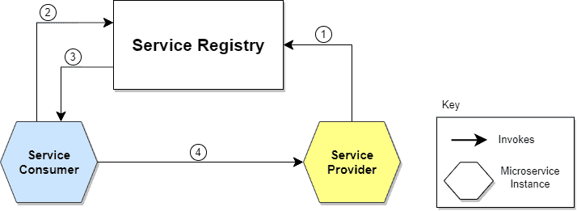
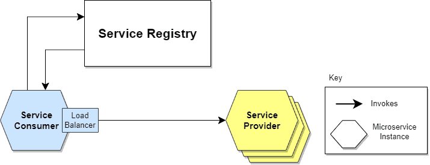
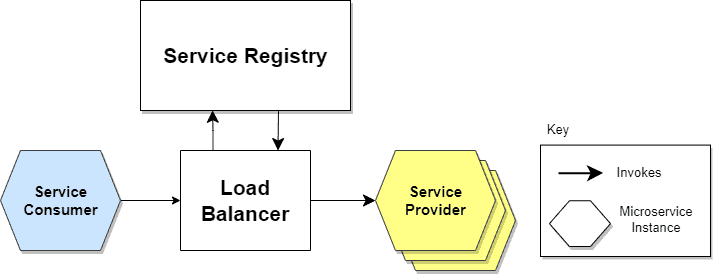
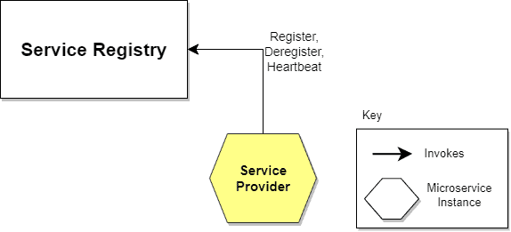
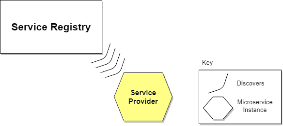
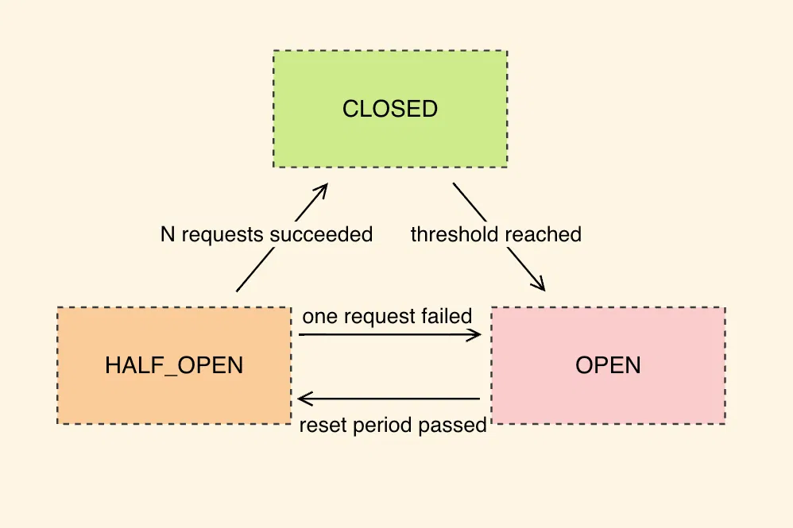

## Http Clients

Def: is any program that sends requests to HTTP server and receives responses

### OpenFeign

Def: is a declarative HTTP client library that's part of the Spring Cloud ecosystem,designed to make calling REST APIs as simple as defining an interface.
Think of it as a way to turn HTTP API calls into method calls that feel just like calling any other Java method in your application.

#### The Core Concept

Imagine you need to call a REST API to get user information from another service. Traditionally, you'd write code using RestTemplate or WebClient, manually constructing URLs, handling HTTP headers, and parsing responses.
==OpenFeign== eliminates this boilerplate by letting you define what you want to call rather than how to call it.

```aiignore
@Service
public class UserService {
    private final RestTemplate restTemplate;

    public User getUserById(Long id) {
        String url = "http://user-service/users/" + id;
        return restTemplate.getForObject(url, User.class);
    }
}
```

##### With OpenFeign:

```aiignore
@FeignClient(name = "user-service")
public interface UserClient {
    @GetMapping("/users/{id}")
    User getUserById(@PathVariable Long id);
}
```

##### How It Works Under the Hood

When Spring Boot starts up, it scans for interfaces annotated with @FeignClient and creates proxy implementations at runtime. These proxies intercept your method calls and translate them into HTTP requests using the annotations you've provided
**The process flows like this**: Your code calls the interface method → Feign proxy intercepts the call → Converts annotations to HTTP request → Sends request via HTTP client → Parses response back to Java object → Returns result to your code.

##### Key Components and Configuration

OpenFeign integrates seamlessly with other Spring Cloud components. For ==service discovery==, it works with Eureka or Consul to resolve service names to actual network locations. When you specify @FeignClient(name = "user-service"), Feign doesn't need to know the exact URL - it asks the service registry where "user-service" is running.

For ==load balancing==, Feign automatically integrates with Spring Cloud LoadBalancer (or the older Ribbon). If multiple instances of "user-service" are running, Feign will distribute requests among them using your configured load balancing strategy.

```
@FeignClient(
    name = "payment-service",
    configuration = PaymentClientConfig.class,
    fallback = PaymentClientFallback.class
)
public interface PaymentClient {

    @PostMapping("/payments")
    PaymentResponse processPayment(@RequestBody PaymentRequest request);

    @GetMapping("/payments/{id}")
    Payment getPayment(@PathVariable String id, @RequestHeader("Authorization") String token);

    @PutMapping("/payments/{id}/status")
    void updatePaymentStatus(@PathVariable String id, @RequestParam String status);
}
```

##### Error Handling and Resilience

OpenFeign integrates with ==Circuit Breaker== patterns through Spring Cloud Circuit Breaker. You can define fallback methods that execute when the target service is unavailable, preventing cascading failures in your microservices architecture.

```
@Component
public class PaymentClientFallback implements PaymentClient {
    @Override
    public PaymentResponse processPayment(PaymentRequest request) {
        // Return cached response or default behavior
        return PaymentResponse.builder()
            .status("PENDING")
            .message("Payment service temporarily unavailable")
            .build();
    }
}
```


---

## Service Discovery
Let’s imagine several microservices that make up a more or less complex application. These will communicate with each other somehow (e.g. API Rest, gRPC).

A microservices-based application typically runs in virtualized or containerized environments. The number of instances of a service and its locations changes dynamically. We need to know where these instances are and their names to allow requests to arrive at the target microservice. This is where tactics such as Service Discovery come into play.

**The Service Discovery mechanism helps us know where each instance is located. In this way, a Service Discovery component acts as a registry in which the addresses of all instances are tracked.** 
- A microservice needs to know the location (IP address and port) of every service it communicates with

### How Does Service Discovery Works?
Service Discovery handles things in two parts. First, it provides a mechanism for an instance to register and say, “I’m here!” Second, it provides a way to find the service once it has registered.


- The location of the Service Provider is sent to the Service Registry (a database containing the locations of all available service instances).
- The Service Consumer asks the Service Discovery Server for the location of the Service Provider.
- The location of the Service Provider is searched by the Service Registry in its internal database and returned to the Service Consumer.
- The Service Consumer can now make direct requests to the Service Provider.

###  Service Discovery Implementations
#### Client-Side Service Discovery
When using Client-Side Discovery, the Service Consumer is responsible for determining the network locations of available service instances and load balancing requests between them
*How it works*: The client queries the Service Register. Then the client uses a load-balancing algorithm to choose one of the available service instances and performs a request.


Giving responsibility for client-side load balancing is both a burden and an advantage. It’s an advantage because it saves an extra hop that we would’ve had with a dedicated load balancer. It’s a disadvantage because the Service Consumer must implement the load balancing logic.

#### Server-Side Service Discovery

The alternate approach to Service Discovery is the Server-Side Discovery model, which uses an intermediary that acts as a Load Balancer. 

*How it works*: The client makes a request to a service via a load balancer that acts as an orchestrator. The load balancer queries the Service Registry and routes each request to an available service instance.



### What Is Service Registry?

Def:  It’s a database containing the network locations of service instances. A Service Registry must be highly available and up-to-date

#### Self-Registration
When using the self-registration model, a service instance is responsible for ==registering and de-registering itself== in the Service Registry



One advantage is that it’s relatively simple and doesn’t require other system components as intermediaries. However, a significant disadvantage is that it couples service instances to the Service Registry, which means we must implement the registration code in each language and framework used.

#### Third-party Registration

The Service Register keeps track of changes to running instances by polling the deployment environment or subscribing to events. 



## Circuit breaker
Def: Circuit Breaker là một design pattern được tạo ra để ==ngăn chặn lỗi lan rộng== trong các hệ thống phân tán đặc biệt là trong kiến trúc microservices

Trong kiến trúc microservices, các service thường xuyên gọi lẫn nhau để xử lý dữ liệu. Nhưng điều gì sẽ xảy ra nếu một service gặp sự cố? Ví dụ:
- Service A gọi đến Service B, và Service B lại phụ thuộc vào Service C.
- Nếu Service C gặp vấn đề (timeout, lỗi, hoặc quá tải):
    - Service B sẽ phải chờ đợi phản hồi từ Service C (hoặc bị timeout).
    - Điều này làm Service B bị chiếm dụng tài nguyên (threads, connections).
    - Kết quả là Service A cũng phải chờ đợi, và toàn bộ hệ thống dần bị "tắc nghẽn".

**-->** Hãy tưởng tượng Circuit Breaker (CB) giống như một cầu dao điện trong nhà bạn: khi phát hiện dòng điện quá tải, cầu dao sẽ ngắt mạch để bảo vệ toàn bộ hệ thống khỏi bị hư hại.
**-->** Trong phần mềm, Circuit Breaker cũng hoạt động tương tự:
- Khi một service gặp sự cố (quá tải hoặc không phản hồi), CB sẽ ngắt các request đến service đó để tránh tạo thêm áp lực.
- Điều này giúp cho service có thời gian phục hồi, đồng thời ngăn không cho lỗi lây lan sang các phần khác trong hệ thống.
- Kết quả: Tăng tính ổn định hệ thống và ngăn chặn hiệu ứng domino trong microservices.

### Cách hoạt động của Circuit Breaker
==Closed (Trạng thái bình thường)==
- Tất cả các request đều được gửi đến service đích như bình thường.
- Circuit Breaker theo dõi số lượng lỗi xảy ra.
- Nếu số lỗi vượt quá một ngưỡng cho phép → chuyển sang trạng thái Open.

==Open (Ngắt mạch)==
- Tất cả các request đến service đích sẽ bị chặn lại.
- Thay vì chờ đợi, Circuit Breaker sẽ fail fast (ngắt ngay) hoặc trả về một fallback response.
- Sau một khoảng thời gian timeout → chuyển sang trạng thái Half-Open để thử nghiệm.

==Half-Open (Thử nghiệm)== 
- Cho phép một số lượng nhỏ request thử nghiệm được gửi đến service đích.
- Nếu các request này thành công → quay lại trạng thái Closed (bình thường).
- Nếu tiếp tục thất bại → chuyển lại trạng thái Open.



