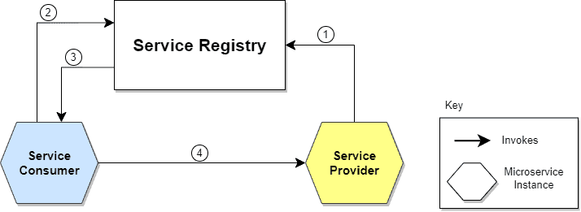

# Book Network

This project is a microservices-based application that simulates a book social network. It allows users to create profiles, connect with other users, and share information about books.

## Architecture

The application is built using a microservices architecture, with several services working together to provide the full functionality. The main components are:

*   **API Gateway:** The single entry point for all client requests. It routes requests to the appropriate microservice and handles cross-cutting concerns like authentication.
*   **Service Discovery:** Services register themselves with a discovery server, allowing them to find and communicate with each other without hardcoded URLs.
*   **Circuit Breaker:** Implemented to prevent cascading failures when a service is down or experiencing issues.

### Architecture Diagrams

Here are some diagrams that illustrate the architecture of the system:

**High-Level Architecture**


**Service Discovery**


**Circuit Breaker**


## Services

The project is composed of the following microservices:

### 1. API Gateway (`api-gateway`)

*   **Description:** The front door to the application. All incoming requests are processed here first.
*   **Technology:** Spring Cloud Gateway.

### 2. Identity Service (`identity-service`)

*   **Description:** Manages user authentication, authorization, roles, and permissions.
*   **Technology:** Spring Boot, Spring Security (OAuth2), JPA, MySQL.

### 3. Profile Service (`profile-service`)

*   **Description:** Manages user profiles and the relationships between them (e.g., friendships).
*   **Technology:** Spring Boot, Spring Data Neo4j.

### 4. Notification Service (`notification-service`)

*   **Description:** Sends notifications to users, such as emails.
*   **Technology:** Spring Boot, Spring Data MongoDB, SendGrid.

### 5. Book Service (`book-service`)

*   **Description:** Manages book information, including details, ratings, and reviews.
*   **Technology:** Spring Boot, likely with a relational database like MySQL or PostgreSQL.

### 6. File Service (`file-service`)

*   **Description:** Handles file uploads and storage, such as book covers or user profile pictures.
*   **Technology:** Spring Boot, likely with a cloud storage service like AWS S3 or a local file store.

### 7. Post Service (`post-service`)

*   **Description:** Manages user posts and comments.
*   **Technology:** Spring Boot, likely with a NoSQL database like MongoDB for flexible schema.

### 8. Search Service (`search-service`)

*   **Description:** Provides search functionality across the platform, including users, books, and posts.
*   **Technology:** Spring Boot, likely with a search engine like Elasticsearch.

## Getting Started

To run this project, you will need to have the following installed:

*   Java 21
*   Maven
*   Docker

### Database Setup

You can use Docker to easily set up the required databases.

**MySQL:**

```bash
docker run --name mysql -e MYSQL_ROOT_PASSWORD=root -e MYSQL_DATABASE=book-network -p 3306:3306 -d mysql:8
```

**Neo4j:**

```bash
docker run --name neo4j -p 7474:7474 -p 7687:7687 -d -e NEO4J_AUTH=neo4j/password neo4j:5
```

**MongoDB:**

```bash
docker run --name mongo -p 27017:27017 -d mongo
```

### Running the Application

Each service can be built and run individually. It is recommended to start the services in the following order:

1.  **Identity Service**
2.  **Profile Service**
3.  **Book Service**
4.  **File Service**
5.  **Post Service**
6.  **Search Service**
7.  **Notification Service**
8.  **API Gateway**

To build a service, navigate to its directory and run:

```bash
mvn clean package
```

To run a service, use the following command:

```bash
mvn spring-boot:run
```

You will need to configure each service to connect to the appropriate database and other services. Check the `application.yml` or `application.yaml` file in each service's `src/main/resources` directory for configuration options.

## Technologies Used

*   **Backend:** Java 21, Spring Boot, Spring Cloud
*   **Databases:** MySQL, Neo4j, MongoDB
*   **Authentication:** OAuth2, JWT
*   **API Gateway:** Spring Cloud Gateway
*   **Communication:** REST APIs, OpenFeign
*   **Build Tool:** Maven
